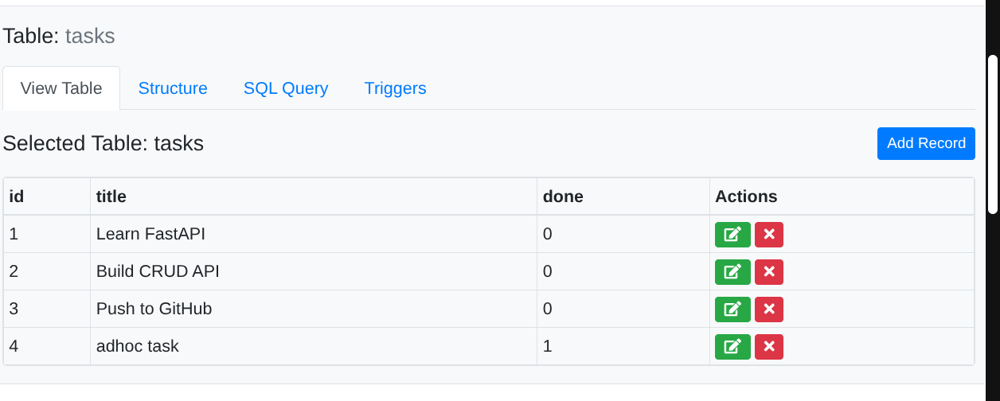
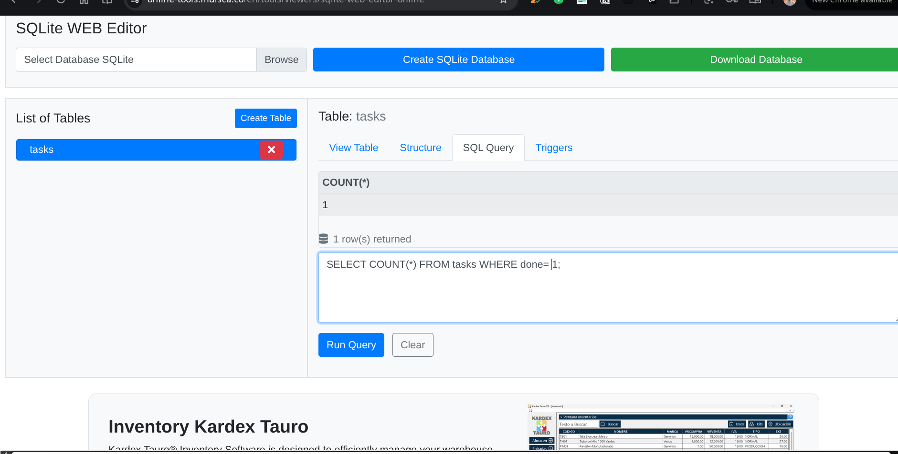
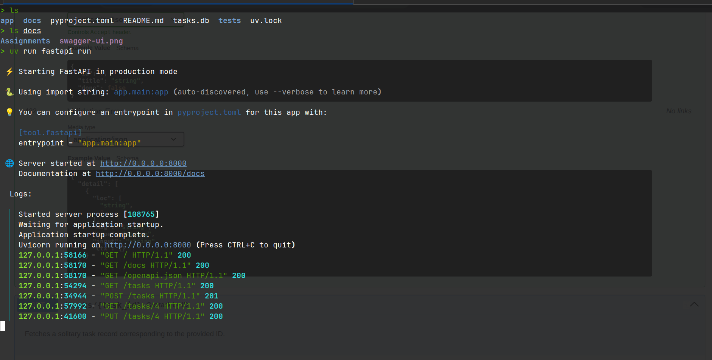

# Task API

A small, standalone REST API for managing tasks. It is built with FastAPI and
SQLite, with request validation, JSON error responses, persistent local storage,
and automated endpoint tests.

## Contents

- [Features](#features)
- [Tech stack](#tech-stack)
- [Run locally](#run-locally)
- [API reference](#api-reference)
- [Database](#database)
- [Tests](#tests)
- [Project evidence](#project-evidence)
- [Stretch goals](#stretch-goals)

## Features

- Create, list, retrieve, update, and delete tasks
- Validate task titles and update payloads
- Return consistent JSON errors for invalid input, missing tasks, unknown routes,
  and unexpected server errors
- Store tasks in a local SQLite database that survives server restarts
- Seed a fresh database with example tasks
- Explore the API through Swagger UI

## Tech stack

- Python 3.12
- FastAPI and Uvicorn
- Pydantic
- SQLite via Python's built-in `sqlite3` module
- Pytest and HTTPX for automated tests

## Run locally

```bash
uv sync
uv run uvicorn app.main:app --reload
```

The API is available at <http://127.0.0.1:8000>. Interactive documentation is
available at <http://127.0.0.1:8000/docs>.

On first startup, the application creates a local `tasks.db` file, creates the
`tasks` table, and seeds three example tasks. The database is intentionally
ignored by Git: it is runtime data, and every clone can generate its own clean
copy.

## API reference

| Method | Endpoint | Description |
|---|---|---|
| `GET` | `/` | API metadata |
| `GET` | `/health` | Health check |
| `GET` | `/tasks` | List all tasks |
| `GET` | `/tasks/{task_id}` | Get a task by ID |
| `POST` | `/tasks` | Create a task |
| `PUT` | `/tasks/{task_id}` | Update a task title, completion state, or both |
| `DELETE` | `/tasks/{task_id}` | Delete a task |

Create a task:

```bash
curl -X POST http://127.0.0.1:8000/tasks \
  -H "Content-Type: application/json" \
  -d '{"title":"Learn FastAPI"}'
```

Example response:

```json
{
  "id": 4,
  "title": "Learn FastAPI",
  "done": false
}
```

## Database

SQLite keeps the entire database in one local file and needs no separate
database server. You can inspect `tasks.db` in DB Browser for SQLite while the
API is running; changes made there are visible through `GET /tasks` because
both tools use the same file.

For example, list completed tasks with:

```sql
SELECT * FROM tasks WHERE done = 1;
```

## Tests

Run the automated test suite:

```bash
uv run pytest -v
```

Each test uses its own temporary SQLite file, so tests never modify your local
`tasks.db`. A lightweight manual smoke-test script is also available after the
server starts:

```bash
uv run python tests/test.py
```

## Project evidence

Swagger UI:


SQLite table inspection:



Manual SQL query execution:



CRUD API logs:



## Stretch goals

The next optional iteration is planned in
[the Week 3 extras plan](docs/W3-extras-implementation-plan.md). It covers
database-side search and status filtering, alphabetical SQL ordering, SQL-based
statistics, and task timestamps. These extras are intentionally not implemented
yet, so the current API contract remains the CRUD API documented above.

Changing a table's shape makes existing database files a compatibility concern.
That is the practical reason migrations exist: they make schema changes safe
and repeatable across environments.
