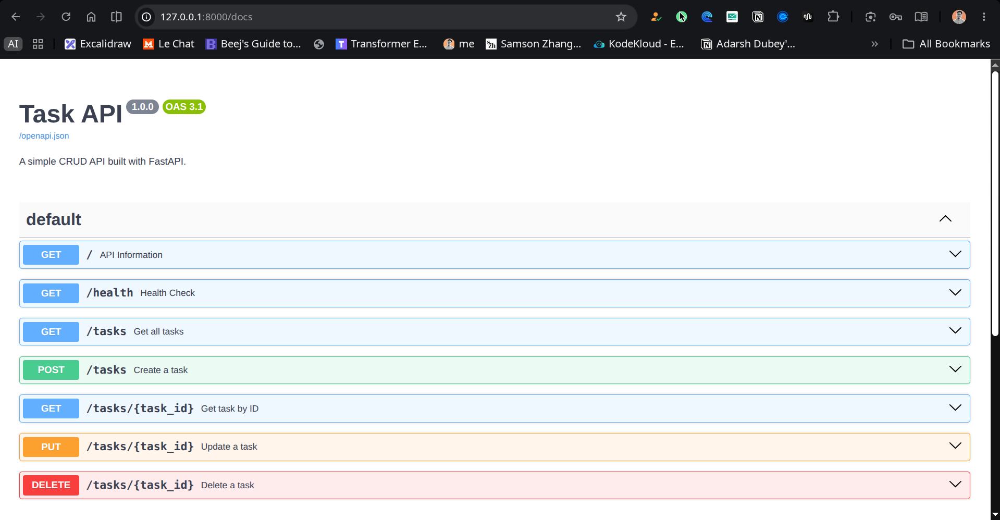

# Task API

A simple CRUD API built with FastAPI for the FlyRank Backend AI Engineering Internship - Week 2 assignment.

## Features

- Create a task
- Read all tasks
- Read a task by ID
- Update a task
- Delete a task
- Interactive Swagger UI

## Tech Stack

- Python 3.12
- FastAPI
- Uvicorn
- Pydantic

## Installation

```bash
uv sync
```

## Run the API

```bash
uv run uvicorn app.main:app --reload
```

The API will be available at:

http://127.0.0.1:8000

Swagger UI:

http://127.0.0.1:8000/docs

## Run the Test Script

```bash
uv run python test.py
```

## API Endpoints

| Method | Endpoint | Description |
|---------|----------|-------------|
| GET | / | API information |
| GET | /health | Health check |
| GET | /tasks | List all tasks |
| GET | /tasks/{task_id} | Get task by ID |
| POST | /tasks | Create a task |
| PUT | /tasks/{task_id} | Update a task |
| DELETE | /tasks/{task_id} | Delete a task |

## Sample Request

```bash
curl -X POST http://127.0.0.1:8000/tasks \
-H "Content-Type: application/json" \
-d '{"title":"Learn FastAPI"}'
```

## Sample Response

```json
{
  "id": 4,
  "title": "Learn FastAPI",
  "done": false
}
```

## Swagger UI

